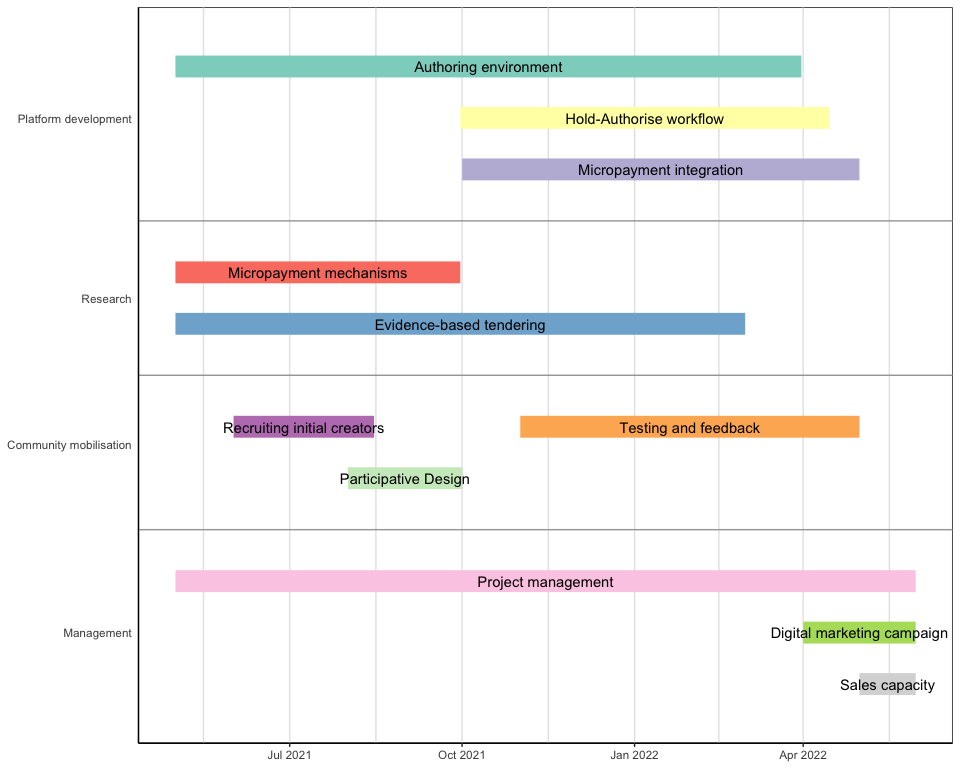

# Mindgarden SmartGrant Project Plan

| group                  | event                       | details                                                        |
|:-----------------------|:----------------------------|:---------------------------------------------------------------|
| Platform development   | Authoring environment       | Tools for interactive multimedia development and device APIs   |
| Platform development   | Hold-Authorise workflow     | Content moderation, approval and feedback                      |
| Platform development   | Micropayment integration    | Payment for content weighted by popularity                     |
| Research               | Micropayment mechanisms     | Best approaches to creator reimbursement                       |
| Research               | Evidence-based tendering    | Integrating science with content requirements                  |
| Community mobilisation | Testing and feedback        | Trials of content tools and payment systems                    |
| Management             | Digital marketing campaign  | Social media and search marketing                              |
| Management             | Project management          | Work package coordinaton, resourcing, monitoring and reporting |
| Management             | Sales capacity              | Sale of private and insitutional subscriptions                 |
| Community mobilisation | Recruiting initial creators | Identification of power users in community                     |
| Community mobilisation | Participative Design        | Contultation and user design                                   |