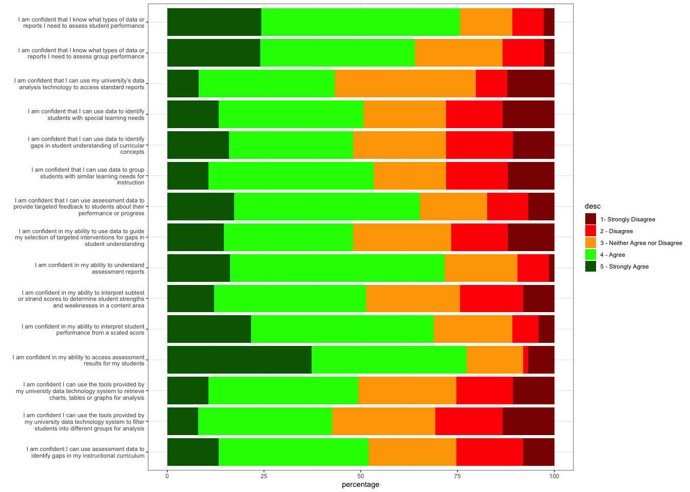
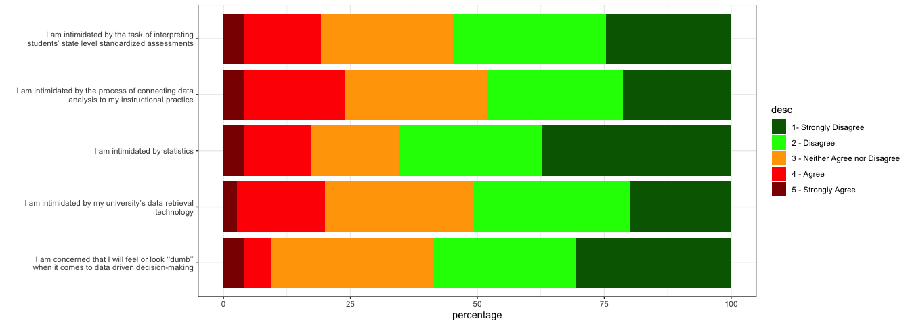
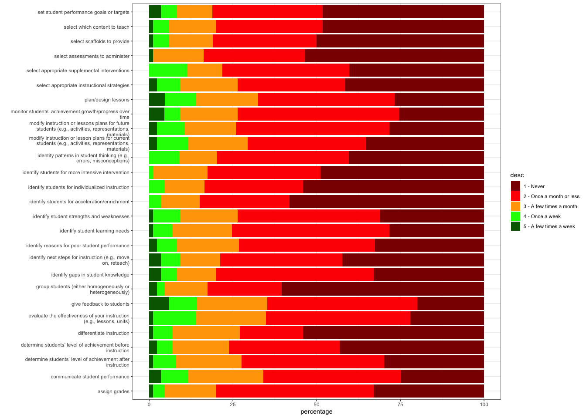

# Academic Data Literacy Project (DLP)
Paul Matthews
2023-11-18

## 

# Overall Agreement / Disagreement with Likert Statements

# Confidence differences by experience, gender

## Correlation between likerts and years of experience

<table class="gt_table" data-quarto-disable-processing="false" data-quarto-bootstrap="false">
  <thead>
    &#10;    <tr class="gt_col_headings">
      <th class="gt_col_heading gt_columns_bottom_border gt_left" rowspan="1" colspan="1" scope="col" id=""></th>
      <th class="gt_col_heading gt_columns_bottom_border gt_right" rowspan="1" colspan="1" scope="col" id="correlation">correlation</th>
      <th class="gt_col_heading gt_columns_bottom_border gt_right" rowspan="1" colspan="1" scope="col" id="p value">p value</th>
    </tr>
  </thead>
  <tbody class="gt_table_body">
    <tr><th id="stub_1_1" scope="row" class="gt_row gt_left gt_stub">identity patterns in student thinking (e.g., errors, misconceptions) </th>
<td headers="stub_1_1 correlation" class="gt_row gt_right">0.49705640</td>
<td headers="stub_1_1 p value" class="gt_row gt_right">0.07803872</td></tr>
    <tr><th id="stub_1_2" scope="row" class="gt_row gt_left gt_stub">determine students’ level of achievement before instruction </th>
<td headers="stub_1_2 correlation" class="gt_row gt_right">0.63675139</td>
<td headers="stub_1_2 p value" class="gt_row gt_right">-0.05467134</td></tr>
    <tr><th id="stub_1_3" scope="row" class="gt_row gt_left gt_stub">determine students’ level of achievement after instruction </th>
<td headers="stub_1_3 correlation" class="gt_row gt_right">0.61029443</td>
<td headers="stub_1_3 p value" class="gt_row gt_right">-0.05939393</td></tr>
    <tr><th id="stub_1_4" scope="row" class="gt_row gt_left gt_stub">monitor students’ achievement growth/progress over time </th>
<td headers="stub_1_4 correlation" class="gt_row gt_right">0.19685527</td>
<td headers="stub_1_4 p value" class="gt_row gt_right">-0.14968287</td></tr>
    <tr><th id="stub_1_5" scope="row" class="gt_row gt_left gt_stub">identify student strengths and weaknesses </th>
<td headers="stub_1_5 correlation" class="gt_row gt_right">0.49555694</td>
<td headers="stub_1_5 p value" class="gt_row gt_right">-0.07936498</td></tr>
    <tr><th id="stub_1_6" scope="row" class="gt_row gt_left gt_stub">select appropriate instructional strategies </th>
<td headers="stub_1_6 correlation" class="gt_row gt_right">0.43138420</td>
<td headers="stub_1_6 p value" class="gt_row gt_right">-0.09158296</td></tr>
    <tr><th id="stub_1_7" scope="row" class="gt_row gt_left gt_stub">select appropriate supplemental interventions </th>
<td headers="stub_1_7 correlation" class="gt_row gt_right">0.83439517</td>
<td headers="stub_1_7 p value" class="gt_row gt_right">-0.02438227</td></tr>
    <tr><th id="stub_1_8" scope="row" class="gt_row gt_left gt_stub">plan/design lessons </th>
<td headers="stub_1_8 correlation" class="gt_row gt_right">0.06671338</td>
<td headers="stub_1_8 p value" class="gt_row gt_right">-0.21286753</td></tr>
    <tr><th id="stub_1_9" scope="row" class="gt_row gt_left gt_stub">evaluate the effectiveness of your instruction (e.g., lessons, units) </th>
<td headers="stub_1_9 correlation" class="gt_row gt_right">0.09356342</td>
<td headers="stub_1_9 p value" class="gt_row gt_right">-0.19504239</td></tr>
    <tr><th id="stub_1_10" scope="row" class="gt_row gt_left gt_stub">group students (either homogeneously or heterogeneously) </th>
<td headers="stub_1_10 correlation" class="gt_row gt_right">0.78101782</td>
<td headers="stub_1_10 p value" class="gt_row gt_right">-0.03263951</td></tr>
    <tr><th id="stub_1_11" scope="row" class="gt_row gt_left gt_stub">identify reasons for poor student performance </th>
<td headers="stub_1_11 correlation" class="gt_row gt_right">0.16352031</td>
<td headers="stub_1_11 p value" class="gt_row gt_right">-0.16254569</td></tr>
    <tr><th id="stub_1_12" scope="row" class="gt_row gt_left gt_stub">select assessments to administer </th>
<td headers="stub_1_12 correlation" class="gt_row gt_right">0.36095229</td>
<td headers="stub_1_12 p value" class="gt_row gt_right">-0.10698160</td></tr>
    <tr><th id="stub_1_13" scope="row" class="gt_row gt_left gt_stub">identify students for more intensive intervention </th>
<td headers="stub_1_13 correlation" class="gt_row gt_right">0.52612907</td>
<td headers="stub_1_13 p value" class="gt_row gt_right">-0.07434679</td></tr>
    <tr><th id="stub_1_14" scope="row" class="gt_row gt_left gt_stub">identify students for acceleration/enrichment </th>
<td headers="stub_1_14 correlation" class="gt_row gt_right">0.32085197</td>
<td headers="stub_1_14 p value" class="gt_row gt_right">-0.11619083</td></tr>
    <tr><th id="stub_1_15" scope="row" class="gt_row gt_left gt_stub">identify students for individualized instruction </th>
<td headers="stub_1_15 correlation" class="gt_row gt_right">0.15877813</td>
<td headers="stub_1_15 p value" class="gt_row gt_right">-0.16550084</td></tr>
    <tr><th id="stub_1_16" scope="row" class="gt_row gt_left gt_stub">identify next steps for instruction (e.g., move on, reteach) </th>
<td headers="stub_1_16 correlation" class="gt_row gt_right">0.48227794</td>
<td headers="stub_1_16 p value" class="gt_row gt_right">-0.08295195</td></tr>
    <tr><th id="stub_1_17" scope="row" class="gt_row gt_left gt_stub">modify instruction or lessons plans for future students (e.g., activities, representations, materials) </th>
<td headers="stub_1_17 correlation" class="gt_row gt_right">0.58815321</td>
<td headers="stub_1_17 p value" class="gt_row gt_right">-0.06397435</td></tr>
    <tr><th id="stub_1_18" scope="row" class="gt_row gt_left gt_stub">modify instruction or lesson plans for current students (e.g., activities, representations, materials) </th>
<td headers="stub_1_18 correlation" class="gt_row gt_right">0.74301554</td>
<td headers="stub_1_18 p value" class="gt_row gt_right">-0.03875879</td></tr>
    <tr><th id="stub_1_19" scope="row" class="gt_row gt_left gt_stub">set student performance goals or targets </th>
<td headers="stub_1_19 correlation" class="gt_row gt_right">0.92656496</td>
<td headers="stub_1_19 p value" class="gt_row gt_right">-0.01089950</td></tr>
    <tr><th id="stub_1_20" scope="row" class="gt_row gt_left gt_stub">select which content to teach </th>
<td headers="stub_1_20 correlation" class="gt_row gt_right">0.05595453</td>
<td headers="stub_1_20 p value" class="gt_row gt_right">-0.22318273</td></tr>
    <tr><th id="stub_1_21" scope="row" class="gt_row gt_left gt_stub">differentiate instruction </th>
<td headers="stub_1_21 correlation" class="gt_row gt_right">0.23322815</td>
<td headers="stub_1_21 p value" class="gt_row gt_right">-0.14027876</td></tr>
    <tr><th id="stub_1_22" scope="row" class="gt_row gt_left gt_stub">select scaffolds to provide </th>
<td headers="stub_1_22 correlation" class="gt_row gt_right">0.32865670</td>
<td headers="stub_1_22 p value" class="gt_row gt_right">-0.11594350</td></tr>
    <tr><th id="stub_1_23" scope="row" class="gt_row gt_left gt_stub">identify student learning needs </th>
<td headers="stub_1_23 correlation" class="gt_row gt_right">0.26467781</td>
<td headers="stub_1_23 p value" class="gt_row gt_right">-0.13133631</td></tr>
    <tr><th id="stub_1_24" scope="row" class="gt_row gt_left gt_stub">communicate student performance </th>
<td headers="stub_1_24 correlation" class="gt_row gt_right">0.63669423</td>
<td headers="stub_1_24 p value" class="gt_row gt_right">-0.05581415</td></tr>
    <tr><th id="stub_1_25" scope="row" class="gt_row gt_left gt_stub">give feedback to students </th>
<td headers="stub_1_25 correlation" class="gt_row gt_right">0.01683872</td>
<td headers="stub_1_25 p value" class="gt_row gt_right">-0.27710901</td></tr>
    <tr><th id="stub_1_26" scope="row" class="gt_row gt_left gt_stub">assign grades </th>
<td headers="stub_1_26 correlation" class="gt_row gt_right">0.64946991</td>
<td headers="stub_1_26 p value" class="gt_row gt_right">-0.05371065</td></tr>
    <tr><th id="stub_1_27" scope="row" class="gt_row gt_left gt_stub">identify gaps in student knowledge</th>
<td headers="stub_1_27 correlation" class="gt_row gt_right">0.15376149</td>
<td headers="stub_1_27 p value" class="gt_row gt_right">-0.16748979</td></tr>
  </tbody>
  &#10;  
</table>

<table class="gt_table" data-quarto-disable-processing="false" data-quarto-bootstrap="false">
  <thead>
    &#10;    <tr class="gt_col_headings">
      <th class="gt_col_heading gt_columns_bottom_border gt_left" rowspan="1" colspan="1" scope="col" id=""></th>
      <th class="gt_col_heading gt_columns_bottom_border gt_right" rowspan="1" colspan="1" scope="col" id="correlation">correlation</th>
      <th class="gt_col_heading gt_columns_bottom_border gt_right" rowspan="1" colspan="1" scope="col" id="p value">p value</th>
    </tr>
  </thead>
  <tbody class="gt_table_body">
    <tr><th id="stub_1_1" scope="row" class="gt_row gt_left gt_stub">I am confident in my ability to access assessment results for my students</th>
<td headers="stub_1_1 correlation" class="gt_row gt_right">0.83540931</td>
<td headers="stub_1_1 p value" class="gt_row gt_right">0.025865548</td></tr>
    <tr><th id="stub_1_2" scope="row" class="gt_row gt_left gt_stub">I am confident that I know what types of data or reports I need to assess group performance</th>
<td headers="stub_1_2 correlation" class="gt_row gt_right">0.69156514</td>
<td headers="stub_1_2 p value" class="gt_row gt_right">0.049368004</td></tr>
    <tr><th id="stub_1_3" scope="row" class="gt_row gt_left gt_stub">I am confident that I know what types of data or reports I need to assess student performance</th>
<td headers="stub_1_3 correlation" class="gt_row gt_right">0.52546471</td>
<td headers="stub_1_3 p value" class="gt_row gt_right">0.079552207</td></tr>
    <tr><th id="stub_1_4" scope="row" class="gt_row gt_left gt_stub">I am confident I can use the tools provided by my university data technology system to retrieve charts, tables or graphs for analysis</th>
<td headers="stub_1_4 correlation" class="gt_row gt_right">0.65998469</td>
<td headers="stub_1_4 p value" class="gt_row gt_right">0.054736286</td></tr>
    <tr><th id="stub_1_5" scope="row" class="gt_row gt_left gt_stub">I am confident I can use the tools provided by my university data technology system to filter students into different groups for analysis</th>
<td headers="stub_1_5 correlation" class="gt_row gt_right">0.04154901</td>
<td headers="stub_1_5 p value" class="gt_row gt_right">0.249722193</td></tr>
    <tr><th id="stub_1_6" scope="row" class="gt_row gt_left gt_stub">I am confident that I can use my university’s data analysis technology to access standard reports</th>
<td headers="stub_1_6 correlation" class="gt_row gt_right">0.13587129</td>
<td headers="stub_1_6 p value" class="gt_row gt_right">0.185518672</td></tr>
    <tr><th id="stub_1_7" scope="row" class="gt_row gt_left gt_stub">I am confident in my ability to understand assessment reports</th>
<td headers="stub_1_7 correlation" class="gt_row gt_right">0.55948185</td>
<td headers="stub_1_7 p value" class="gt_row gt_right">0.073138702</td></tr>
    <tr><th id="stub_1_8" scope="row" class="gt_row gt_left gt_stub">I am confident in my ability to interpret student performance from a scaled score</th>
<td headers="stub_1_8 correlation" class="gt_row gt_right">0.52291574</td>
<td headers="stub_1_8 p value" class="gt_row gt_right">0.080040895</td></tr>
    <tr><th id="stub_1_9" scope="row" class="gt_row gt_left gt_stub">I am confident in my ability to interpret subtest or strand scores to determine student strengths and weaknesses in a content area</th>
<td headers="stub_1_9 correlation" class="gt_row gt_right">0.96010537</td>
<td headers="stub_1_9 p value" class="gt_row gt_right">-0.006277079</td></tr>
    <tr><th id="stub_1_10" scope="row" class="gt_row gt_left gt_stub">I am confident that I can use data to identify students with special learning needs</th>
<td headers="stub_1_10 correlation" class="gt_row gt_right">0.53546726</td>
<td headers="stub_1_10 p value" class="gt_row gt_right">-0.077043411</td></tr>
    <tr><th id="stub_1_11" scope="row" class="gt_row gt_left gt_stub">I am confident that I can use data to identify gaps in student understanding of curricular concepts</th>
<td headers="stub_1_11 correlation" class="gt_row gt_right">0.66312177</td>
<td headers="stub_1_11 p value" class="gt_row gt_right">-0.054198703</td></tr>
    <tr><th id="stub_1_12" scope="row" class="gt_row gt_left gt_stub">I am confident that I can use assessment data to provide targeted feedback to students about their performance or progress</th>
<td headers="stub_1_12 correlation" class="gt_row gt_right">0.55060033</td>
<td headers="stub_1_12 p value" class="gt_row gt_right">-0.074214116</td></tr>
    <tr><th id="stub_1_13" scope="row" class="gt_row gt_left gt_stub">I am confident I can use assessment data to identify gaps in my instructional curriculum</th>
<td headers="stub_1_13 correlation" class="gt_row gt_right">0.47377402</td>
<td headers="stub_1_13 p value" class="gt_row gt_right">-0.089017579</td></tr>
    <tr><th id="stub_1_14" scope="row" class="gt_row gt_left gt_stub">I am confident that I can use data to group students with similar learning needs for instruction</th>
<td headers="stub_1_14 correlation" class="gt_row gt_right">0.50722627</td>
<td headers="stub_1_14 p value" class="gt_row gt_right">0.082431460</td></tr>
    <tr><th id="stub_1_15" scope="row" class="gt_row gt_left gt_stub">I am confident in my ability to use data to guide my selection of targeted interventions for gaps in student understanding</th>
<td headers="stub_1_15 correlation" class="gt_row gt_right">0.10858377</td>
<td headers="stub_1_15 p value" class="gt_row gt_right">-0.197812201</td></tr>
    <tr><th id="stub_1_16" scope="row" class="gt_row gt_left gt_stub">I am intimidated by statistics</th>
<td headers="stub_1_16 correlation" class="gt_row gt_right">0.65651717</td>
<td headers="stub_1_16 p value" class="gt_row gt_right">-0.055331660</td></tr>
    <tr><th id="stub_1_17" scope="row" class="gt_row gt_left gt_stub">I am intimidated by the task of interpreting students’ state level standardized assessments</th>
<td headers="stub_1_17 correlation" class="gt_row gt_right">0.34169221</td>
<td headers="stub_1_17 p value" class="gt_row gt_right">-0.119835053</td></tr>
    <tr><th id="stub_1_18" scope="row" class="gt_row gt_left gt_stub">I am concerned that I will feel or look ‘‘dumb’’ when it comes to data driven decision-making</th>
<td headers="stub_1_18 correlation" class="gt_row gt_right">0.28462203</td>
<td headers="stub_1_18 p value" class="gt_row gt_right">-0.132638066</td></tr>
    <tr><th id="stub_1_19" scope="row" class="gt_row gt_left gt_stub">I am intimidated by my university’s data retrieval technology</th>
<td headers="stub_1_19 correlation" class="gt_row gt_right">0.56896860</td>
<td headers="stub_1_19 p value" class="gt_row gt_right">-0.070829644</td></tr>
    <tr><th id="stub_1_20" scope="row" class="gt_row gt_left gt_stub">I am intimidated by the process of connecting data analysis to my instructional practice</th>
<td headers="stub_1_20 correlation" class="gt_row gt_right">0.66543800</td>
<td headers="stub_1_20 p value" class="gt_row gt_right">-0.053802419</td></tr>
  </tbody>
  &#10;  
</table>

